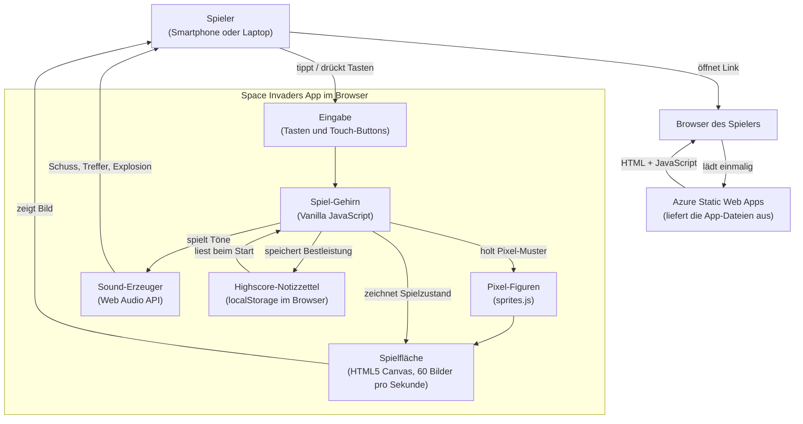

# Architektur: Space Invaders Web-App

## 1. In einfachen Worten

Wir bauen eine Neuauflage des Spieleklassikers **Space Invaders**, die direkt im Browser läuft, ohne Installation. Jeder im Publikum öffnet einfach einen Link auf dem Smartphone und kann sofort mitspielen. Auf dem Bildschirm bewegt sich unten ein Raumschiff nach links und rechts und schießt auf Gegner, die in Wellen von oben angreifen. Ziel ist es, möglichst viele Gegner abzuschießen, bevor sie den Boden erreichen oder einen selbst treffen. Die persönliche Bestleistung wird auf dem eigenen Gerät gemerkt, sodass jeder am Ende des Tages seinen eigenen Highscore vorzeigen kann, getreu dem Ehrenkodex eines kleinen Tagesturniers.

## 2. Die Bausteine

### Die Spielfläche (HTML5 Canvas)
Stell dir eine digitale Maltafel vor, auf der wir 60 Mal pro Sekunde ein neues Bild zeichnen, sodass der Eindruck einer flüssigen Bewegung entsteht. Genau das ist das **Canvas-Element** im Browser. Wir nehmen es, weil es ohne Zusatzbibliotheken sehr schnell pixelgenau zeichnet, ideal für den Retro-Look.

### Die Spiellogik (Vanilla JavaScript)
Das ist das „Gehirn" des Spiels: es entscheidet, wo das Raumschiff steht, wann eine Rakete trifft und wann das Spiel vorbei ist. Wir schreiben das in **purem JavaScript** ohne Frameworks (also ohne große Zusatzbaukästen wie React oder Vue), weil das Spiel klein ist und wir in der 60-Minuten-Demo jede Zeile Code zeigen und erklären wollen.

### Die Optik (sprites.js mit Pixel-Sprites)
Die kleinen Figuren, Schüsse und Bunker werden nicht als Bilddateien geladen, sondern aus winzigen Pixel-Mustern direkt gezeichnet, ähnlich wie ein Kreuzstich-Muster auf Karopapier. Dafür gibt es bereits die vorbereitete Datei [sprites.js](sprites.js), die Muster wie `PLAYER_SPRITE`, `BULLET_SPRITE`, `ALIEN_BULLET_SPRITE`, `TUX_SPRITE`, `WINDOWS_SPRITE`, `CREEPER_SPRITE` und `BUNKER_SPRITE` mitbringt sowie Hilfsfunktionen `drawSprite`, `spriteWidth`, `spriteHeight` und `collides` (Treffer-Erkennung). Vorteil: keine Bilddateien zum Nachladen, alles steckt im Code, und der Pixel-Look passt perfekt zum Original.

### Die Töne (Web Audio API)
Schussgeräusche und Explosionen werden live im Browser erzeugt, vergleichbar mit einem kleinen Synthesizer im Gerät. Die **Web Audio API** macht das möglich, ohne dass wir Sounddateien mitliefern müssen. Das hält die App leicht und vermeidet Ladezeiten oder Urheberrechts-Themen.

### Die Steuerung (Tastatur und Touch-Events)
Am Laptop steuert man mit den Pfeiltasten und der Leertaste. Auf dem Smartphone tippt man auf Buttons am Bildschirmrand, technisch sind das **Touch-Events**, also Berührungssignale, die der Browser an unser Spiel meldet. So kann jeder mitspielen, egal welches Gerät er dabeihat.

### Das Gedächtnis (localStorage)
Der persönliche Highscore wird wie ein Notizzettel direkt im Browser des Spielers abgelegt, in einem Bereich namens **localStorage**. Es gibt bewusst keinen Server und keine zentrale Bestenliste, das ist eine bewusste Vereinfachung für die Demo (Stichwort Ehren-System) und spart uns Themen wie Datenschutz, Login und Backend-Betrieb.

### Der Hosting-Platz (Azure Static Web Apps)
Die fertige App besteht nur aus ein paar Dateien (HTML, JavaScript), die wir auf **Azure Static Web Apps** ablegen. Das ist ein Microsoft-Dienst, der genau für solche „statischen" Web-Apps gemacht ist, also Apps ohne Server-Logik. Vorteile: weltweit schnell erreichbar, https und Domain inklusive, und für unser Demo-Szenario sehr günstig bis kostenfrei.

## 3. Wie alles zusammenspielt

## 4. Technische Details

| Bereich | Technologie | Zweck |
|---|---|---|
| Rendering | HTML5 Canvas 2D Context | Pixelgenaues Zeichnen mit 60 FPS via `requestAnimationFrame` |
| Sprache | Vanilla JavaScript (ES Modules) | Spiellogik, Game-Loop, Kollisionen |
| Sprites | [sprites.js](sprites.js) (`PLAYER_SPRITE`, `BULLET_SPRITE`, `ALIEN_BULLET_SPRITE`, `TUX_SPRITE`, `WINDOWS_SPRITE`, `CREEPER_SPRITE`, `BUNKER_SPRITE`) plus Helpers `drawSprite`, `spriteWidth`, `spriteHeight`, `collides` und `COLOR_PALETTE` | Zentrale Quelle aller Pixel-Grafiken; wird in allen späteren Phasen unverändert wiederverwendet |
| Markup / Layout | HTML5, CSS3 (mobile-first, viewport meta) | Canvas-Container, Touch-Steuerflächen |
| Eingabe | `keydown` / `keyup` Events, `touchstart` / `touchend` Events | Tastatur und Mobile-Steuerung |
| Audio | Web Audio API (`AudioContext`, `OscillatorNode`, `GainNode`) | Schuss-, Treffer- und Explosions-Sounds ohne Asset-Files |
| Persistenz | `window.localStorage` (Schlüssel z. B. `spaceinvaders.highscore`) | Lokaler persönlicher Highscore, Ehren-System |
| Hosting | Azure Static Web Apps (Free Tier) | Globale Auslieferung statischer Dateien, HTTPS inklusive |
| Build / Deploy | Kein Build-Schritt nötig, Deployment via SWA CLI oder GitHub Actions | Schnellstmögliche Demo-Iteration |
| Browser-Support | Aktuelle Versionen von Chrome, Edge, Safari, Firefox (Desktop und Mobile) | Zielgruppe Bundeskunden mit gemischten Geräten |

### Bewusste Nicht-Ziele
- Kein Backend, keine REST-API, keine Datenbank
- Kein globales Leaderboard (Ehren-System)
- Keine Authentifizierung
- Keine Asset-Dateien für Bilder oder Sounds
- Keine Frontend-Frameworks oder Build-Tools
